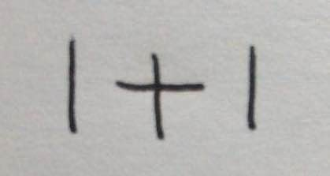
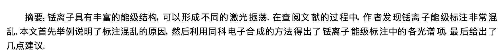

<style>
img{
    width: 200px;
}
</style>

- 服务名称：第二代居民身份证信息识别
- 服务简述：可识别身份证上所有信息：姓名，性别，民族，出生日期，住址，身份证号码
- 服务标签：图像识别
- 服务详情：
	- 身份证识别的广泛应用：金融保险、实名认证APP、警务通、电信实名制、物流公司、流动人口管理、展会访客、信用卡申请等。  
	- 本身份证识别技术，姓名、性别、民族、住址、证件号码一目了然，识别速度快，准确率高，支持接口开发。
- api接口
	- 请求方式 post
	- 参数名 file 
	- python版本请求示例
	```
    headers = {"boundary": "----WebKitFormBoundary7MA4YWxkTrZu0gW"}  
    url = "http://47.105.165.164:7001"
    file = os.path.join(fileDir, "idcardocr.jpg")
    with open(file, "rb") as f:
        files = {'file': f}
        response = requests.post(url=url, files=files, headers=headers)
   -----
   print(response)
   -----
   {
    'status_code': 200, 
    'content': 
        {
         'name': '马美', 
         'sex': '男', 
         'nation': '汉', 
         'address': '河南省信阳市平桥区五里镇凤台村143号', 
         'idnum': '411503198812031030', 
         'birth': '19881203', 
         'error': 0
        }, 
    'response': <Response [200]>
   }
	```
- 服务演示
	- 输入 
	- 输出 
	```
   {
    'status_code': 200, 
    'content': 
        {
         'name': '马美', 
         'sex': '男', 
         'nation': '汉', 
         'address': '河南省信阳市平桥区五里镇凤台村143号', 
         'idnum': '411503198812031030', 
         'birth': '19881203', 
         'error': 0
        }, 
    'response': <Response [200]>
   }
	```

-

- 服务名称：一个拍照做题程序
- 服务简述：输入一张包含数学计算题的图片，输出识别出的数学计算式以及计算结果
- 服务标签：图像识别，教育
- 服务详情：
	- 目前上传的版本只能处理简单的一维加减乘除算术表达式
	- 整个程序使用python实现，具体处理流程包括了图像预处理、字符识别、数学公式识别、数学公式语义理解、结果输出。
	- 应用场景包括但不限于作业要检查，不知道正确答案或解题方法，辅导学习等
- api接口 
	- 请求方式 post
	- 参数名 file 
	- python版本请求示例
	```
	url = "http://47.105.165.164:7002"
   file = os.path.join(fileDir, "math_ai.jpg")
   with open(file, "rb") as f:
       files = {'file': f}
       response = requests.post(url=url, files=files)
   ---
   print(response)
   ---
   {
   	 'status_code': 200, 
   	 'content': 
   	           {
   	            'result': 'http://47.105.165.164:7002/_uploads/PHOTO/1576206098.png'
   	           }, 
   	'response': <Response [200]>
   	}
	``` 
- 服务演示
	- 输入图片  
	- 输出图片 


--

- 服务名称：中国车牌识别
- 服务简述：用python3+opencv3做的中国车牌识别
- 服务标签：交通，图像识别，汽车
- 服务详情
	- 应用场景：视频辅助及车辆识别系统可用于自由车速、收费广场及各种ETC场景。 警车的嵌入式实时处理系统，及点速、均速、红灯场景下的自动识别。无道闸的室内、室外停车及街边停车识别。通行时间预测、通行量统计、动态称重等ITS智能交通应用，提高机动体验等
	- 车牌字符识别使用的算法是opencv的SVM， opencv的SVM使用代码来自于opencv附带的sample，StatModel类和SVM类都是sample中的代码。SVM训练使用的训练样本来自于github上的EasyPR的c++版本。
	- 注意，由于训练样本有限，车牌字符识别，可能存在误差，尤其是第一个中文字符出现的误差概率较大。
- api接口：
	- 请求方式 post
	- 参数名 file
	- python版本请求示例
	```
	url = "http://47.105.165.164:7004"
   file = os.path.join(fileDir, "licensePlateRecognition.jpg")
   with open(file, "rb") as f:
       files = {'file': f}
       response = requests.post(url=url, files=files)
   ---
   print(response)
   ---
   {
   	 'status_code': 200, 
   	 'content': 
   	           {
   	            'result': '京E51619'
   	           }, 
   	'response': <Response [200]>
   	}
	``` 	 
- 服务演示
	- 输入图片 
	- 输出文本 
	```
	{
   	 'status_code': 200, 
   	 'content': 
   	           {
   	            'result': '京E51619'
   	           }, 
   	'response': <Response [200]>
   	}
	``` 


--

- 服务名称：神经网络识别人脸性别
- 服务简述：对图像中人物的性别进行识别，并标在原图上标出。
- 服务标签：图像识别，人脸识别
- readme文档： https://github.com/yu4u/age-gender-estimation
- 服务详情
	- 应用场景：在图书，电商零售等性别需求显著的地方提供更智能的个性化推荐服务。 
	- 首先使用dlib来检测和对齐图片中的人脸，然后使用CNN深度网络来估计性别
- api接口
	- 请求方式 post
	- 参数名 file
	- python版本请求示例
	```
	url = "http://47.105.165.164:7009/gender"
   file = os.path.join(fileDir, "gather.png")
   with open(file, "rb") as f:
       files = {'file': f}
       response = requests.post(url=url, files=files)
   ---
   print(response)
   ---
   {
   	 'status_code': 200, 
   	 'content': 
   	           {
   	            'result': 'http://47.105.165.164:7009/_uploads/PHOTO/1576207403.5848072gather_21.png'
   	           }, 
   	'response': <Response [200]>
   	}
	``` 	
- 服务演示
	- 输入图片 
	- 输出图片  


--


- 服务名称：纸牌识别
- 服务简述：使用OpenCV/Python进行扑克牌识别 
- 服务标签：图像识别
- readme文档 ---> https://arnab.org/blog/so-i-suck-24-automating-card-games-using-opencv-and-python
- 服务详情：
	- 首先将图像转换为灰度色空间，然后对其进行模糊处理，以消除由于照明和相机噪声而产生的伪像。然后，执行自适应阈值处理-即突出显示黑/白之间的差异，以清楚地表示图像中的符号和铭文。为了弥补对齐方面的细微差异，我们在对一个图像与另一个图像进行绝对差异之前和之后再次对图像进行模糊处理，然后对不同像素的强度求和。
	- 这样，识别每张卡就变成了一个比较简单的过程，将每张进来的卡与每张卡在甲板上进行比较，并以最小的差异进行比较。如前所述，有许多更复杂，更健壮的方法（包括涉及使用分类器的方法）。但是，由于这是一个有趣的项目，而且我只有几个小时来编写代码，因此我们将选择耗时最少的版本！
- api接口
	- 请求方式 post
	- 参数名 file
	- python版本请求示例
	```
	url = "http://47.105.165.164:7007"
   file = os.path.join(fileDir, "playing-card-recognition.jpg")
   data = {"num_cards": 4}
   with open(file, "rb") as f:
       files = {'file': f}
       response = requests.post(url=url,data=data,files=files)
   ---
   print(response)
   ---
   {
   	 'status_code': 200, 
   	 'content': 
   	           {
   	            'result': [['8', 'S'], ['7', 'H'], ['3', 'H'], ['6', 'S']]
   	           }, 
   	'response': <Response [200]>
   	}
	``` 	
- 服务演示
	- 输入图片 
	- 输出文本 
	```
	{
   	 'status_code': 200, 
   	 'content': 
   	           {
   	            'result': [['8', 'S'], ['7', 'H'], ['3', 'H'], ['6', 'S']]
   	           }, 
   	'response': <Response [200]>
   	}
   	```
   	


--

- 服务名称：中文自然场景文字检测及识别
- 服务简述：基于yolo3 与crnn 实现中文自然场景文字检测及识别
- 服务标签：文本识别
- 服务详情：
	- 应用场景在：纸质文档票据电子化，内容审核与监管等领域
	- 文字方向检测 0、90、180、270度检测（支持dnn/tensorflow）
- api接口
	- 请求方式 post
	- 参数名 file
	- python版本请求示例
	```
	url = "http://47.105.165.164:7008"
   file = os.path.join(fileDir, "chinese_ocr_2.png")
   with open(file, "rb") as f:
       files = {'file': f}
       response = requests.post(url=url,files=files)
   ---
   print(response)
   ---
   {
     'status_code': 200, 
     'content': '摘要:锰离子具有丰富的能级结构可以形成不同的激光振荡.在查阅文献的过程中,作者发现锰离子能级标注非常混乱.本文首先举例说明了标注混乱的原因。然后利用同科电子合成的方法得出了锰离子能级标注中的各光谱项最后给出了!几点建议.\n', 
     'response': <Response [200]>
    }
	``` 	
- 服务演示
	- 输入图片  
	- 输出文本
	```
	{
     'status_code': 200, 
     'content': '摘要:锰离子具有丰富的能级结构可以形成不同的激光振荡.在查阅文献的过程中,作者发现锰离子能级标注非常混乱.本文首先举例说明了标注混乱的原因。然后利用同科电子合成的方法得出了锰离子能级标注中的各光谱项最后给出了!几点建议.\n', 
     'response': <Response [200]>
    }
	```

--

- 项目名称：绘制面部轮廓
- 项目简述：识别图像中的人脸并标出人脸的轮廓
- 服务标签：
- 服务详情：
    - 应用场景：在画素描的场景下可以辅助勾勒出面部轮廓，帮助画画
    - 整形医院可以大致使用，比如预先查看换成某个明星的脸型后的效果展示
    
- api接口
	- 请求方式 post
	- 参数名 file
	- python版本请求示例
	```
	url = "http://47.105.165.164:7009/faceRecognitionOutline"
   file = os.path.join(fileDir, "ag.png")
   with open(file, "rb") as f:
       files = {'file': f}
       response = requests.post(url=url, files=files)
   ---
   print(response)
   ---
   {
   	 'status_code': 200, 
   	 'content': 
   	           {
   	            'result': 'http://47.105.165.164:7009/_uploads/PHOTO/1576648178.8192759ag_22.png'
   	           }, 
   	'response': <Response [200]>
   	}
   	```

- 服务演示
	- 输入图片 
	- 输出图片 


--

- 项目名称：数字化妆
- 项目简述：识别图像中的人脸并化妆
- 服务标签：
- 服务详情：
    - 应用场景可以使用在人物恶搞，
    
- api接口
	- 请求方式 post
	- 参数名 file
	- python版本请求示例 
	```
	url = "http://47.105.165.164:7009/faceRecognitionMakeup"
   file = os.path.join(fileDir, "ag.png")
   with open(file, "rb") as f:
       files = {'file': f}
       response = requests.post(url=url, files=files)
   ---
   print(response)
   ---
   {
   	 'status_code': 200, 
   	 'content': 
   	           {
   	            'result': 'http://47.105.165.164:7009/_uploads/PHOTO/1576648420.6234505ag_23.png'
   	           }, 
   	'response': <Response [200]>
   	}
   	```

- 服务演示
	- 输入图片 
	- 输出图片 

-- 

- 项目名称：标出图像中人脸的表情
- 项目简述：
- 服务标签：
- 服务详情：
    - 面部表情是人体（形体）语言的一部分，是一种生理及心理的反应，通常用于传递情感。        
    - 面部情感的研究始于 19世纪，达尔文在他著名的论著《人类和动物的表情（The Expression of the Emotions in Animals and Man，1872）》
    - 中就阐述了人的面部表情和动物的面部表情之间的联系和区别。        
    - 1971年，Ekman和 Friesen研究了 6 种基本表情 (即高兴、悲伤、惊讶、恐惧、愤怒和厌恶 ) ,
    - 并系统地建立了上千幅不同的人脸表情图象库。六种基本表情的具体面部表现如下： https://www.zhihu.com/question/23003796


- api接口
	- 请求方式 post
	- 参数名 file
	- python版本请求示例 
	```
	url = "http://47.105.165.164:7009/emotion"
   file = os.path.join(fileDir, "emotion.png")
   with open(file, "rb") as f:
       files = {'file': f}
       response = requests.post(url=url, files=files)
   ---
   print(response)
   ---
   {
   	 'status_code': 200, 
   	 'content': 
   	           {
   	            'result': 'http://47.105.165.164:7009/_uploads/PHOTO/1576648571.1048806emotion_11.png'
   	           }, 
   	'response': <Response [200]>
   	}
   	``` 

- 服务演示
	- 输入图片 
	- 输出图片 


-- 


- 项目名称：标出图像中五官的位置
- 项目简述：
- 服务标签：
- 服务详情：
- api接口
	- 请求方式 post
	- 参数名 file
	- python版本请求示例 
	```
	url = "http://47.105.165.164:7009/detectionOpencv"
   file = os.path.join(fileDir, "xingye-1.png")
   with open(file, "rb") as f:
       files = {'file': f}
       response = requests.post(url=url, files=files)
   ---
   print(response)
   ---
   {
   	 'status_code': 200, 
   	 'content': 
   	           {
   	            'result': 'http://47.105.165.164:7009/_uploads/PHOTO/1576648834.1660767xingye-1_11.png'
   	           }, 
   	'response': <Response [200]>
   	}
   	``` 


- 服务演示
	- 输入图片 
	- 输出图片 

 
--


- 项目名称：图像加帽子特效
- 项目简述：
- 服务标签：
- 服务详情：
- api接口
	- 请求方式 post
	- 参数名 file， decorate
	- python版本请求示例 
	```
   url = "http://47.105.165.164:7009/compose"
   file = os.path.join(fileDir, "compose.png")
   decorate = open(os.path.join(fileDir, "maozi-1.png"), "rb")
   with open(file, "rb") as f:
       files = {'file': f, 'decorate':decorate}
       response = requests.post(url=url, files=files)
   ---
   print(response)
   ---
   {
   	 'status_code': 200, 
   	 'content': 
   	           {
   	            'result': 'http://47.105.165.164:7009/_uploads/PHOTO/1576649061.355849compose_13.png'
   	           }, 
   	'response': <Response [200]>
   	}
   	``` 

- 服务演示
	- 输入图片 
	- 输出图片 


--


- 项目名称：图片重新上色
- 项目简述：
- 服务标签：
- 服务详情：
- api接口
	- 请求方式 post
	- 参数名 file
	- python版本请求示例 
	```
	url = "http://47.105.165.164:7009/colorize"
   file = os.path.join(fileDir, "colorize2.png")
   with open(file, "rb") as f:
       files = {'file': f}
       response = requests.post(url=url, files=files)
   ---
   print(response)
   ---
   {
   	 'status_code': 200, 
   	 'content': 
   	           {
   	            'result': 'http://47.105.165.164:7009/_uploads/PHOTO/1576649204.618092colorize2_11.png'
   	           }, 
   	'response': <Response [200]>
   	}
   	``` 


- 服务演示
	- 输入图片 
	- 输出图片 

	
--

- 项目名称：车牌位置标记
- 项目简述：
- 服务标签：
- 服务详情：
- api接口：
	- 请求方式 post
	- 参数名 file
	- python版本请求示例
	```
	url = "http://47.105.165.164:7006"
   file = os.path.join(fileDir, "opencv_car_location.jpg")
   with open(file, "rb") as f:
       files = {'file': f}
       response = requests.post(url=url, files=files)
   ---
   print(response)
   ---
   {
   	 'status_code': 200, 
   	 'content': 
   	           {
   	            'result': 'http://47.105.165.164:7006/_uploads/PHOTO/1576649753.243514opencv_car_location_14.jpg'
   	           }, 
   	'response': <Response [200]>
   	}
   	```

- 服务演示
	- 输入图片 
	- 输出图片 

--

- 项目名称：合并两张图片
- 项目简述
- 服务标签
- 服务详情
- api接口
	- 请求方式 post
	- 参数名 img1，img2
	- python版本请求示例
	```
	url = "http://47.105.165.164:7005"
   img1 = os.path.join(fDir, "01_suburbA.jpg")
   img2 = os.path.join(fDir, "01_suburbB.jpg")
   with open(img1, "rb") as t:
        with open(img2, "rb") as f:
            files = dict(
                img1=t,
                img2=f
            )
            response = requests.post(url=url, files=files)
   ---
   print(response)
   ---
   {
   	 'status_code': 200, 
   	 'content': 
   	           {
   	            'result': 'http://47.105.165.164:7005/_uploads/PHOTO/1576649992.299759401_suburbB_13.jpg'
   	           }, 
   	'response': <Response [200]>
   	}
   	```
   	
   	
- 服务演示
	- 输入图片A 
	- 输入图片B 
	- 输出图片 

	
--

- 项目名称：图片去水印
- 项目简述
- 服务标签
- 服务详情
- api接口
	- 请求方式 post
	- 参数名 template，file
	- python版本请求示例
	```
	url = "http://47.105.165.164:7003"
   template = os.path.join(fDir, "template.jpg")
   file = os.path.join(fDir, "file.jpg")
   with open(template, "rb") as t:
        with open(file, "rb") as f:
            files = dict(
                template=t,
                file=f
            )
            response = requests.post(url=url, files=files)
   ---
   print(response)
   ---
   {
   	 'status_code': 200, 
   	 'content': 
   	           {
   	            'result': 'http://47.105.165.164:7003/_uploads/PHOTO/1576650303.7791777file_12.jpg'
   	           }, 
   	'response': <Response [200]>
   	}
   	```
   	

- 服务演示
	- 输入图片 【template】 
	- 输入图片 【file】
	- 输出图片 

--

- 项目名称：文档扫描
- 项目简述：
- 服务标签：
- 服务详情：
- api接口：
	- 请求方式 post
	- 参数名 file
	- python版本请求示例
	```
	url = "http://47.105.165.164:7011"
   file = os.path.join(fileDir, "chart.JPG")
   with open(file, "rb") as f:
       files = {'file': f}
       response = requests.post(url=url, files=files)
   ---
   print(response)
   ---
   {
   	 'status_code': 200, 
   	 'content': 
   	           {
   	            'result': 'http://47.105.165.164:7006/_uploads/PHOTO/1576649753.243514opencv_car_location_14.jpg'
   	           }, 
   	'response': <Response [200]>
   	}
   	```

- 服务演示
	- 输入图片 
	- 输出图片 


--

- 项目名称：车道检测
- 项目简述：
- 服务标签：
- 服务详情：
- api接口：
	- 请求方式 post
	- 参数名 file
	- python版本请求示例
	```
	url = "http://47.105.165.164:7012"
   file = os.path.join(fileDir, "lane.jpg")
   with open(file, "rb") as f:
       files = {'file': f}
       response = requests.post(url=url, files=files)
   ---
   print(response)
   ---
   {
   	 'status_code': 200, 
   	 'content': 
   	           {
   	            'result': 'http://47.105.165.164:7006/_uploads/PHOTO/1576649753.243514opencv_car_location_14.jpg'
   	           }, 
   	'response': <Response [200]>
   	}
   	```

- 服务演示
	- 输入图片 
	- 输出图片 
