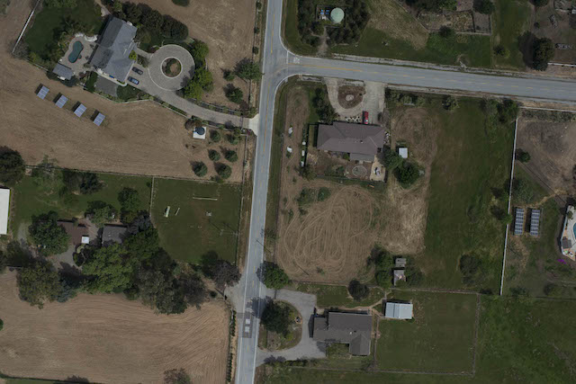

| 应用        | github 链接   |  api详情  |
| --------   | :-----   | :----: |
| mathai        | https://github.com/Roujack/mathAI     |   [jump](#mathai)    |
| image-stitching        | https://github.com/pavanpn/Image-Stitching     |   [jump](#image-stitching)    |
| playing-card-recognition        | https://github.com/arnabdotorg/Playing-Card-Recognition      |   [jump](#playing-card-recognition)    |
| document-scanner       | https://github.com/andrewdcampbell/OpenCV-Document-Scanner     |   [jump](#document-scanner)    |
| lane     | https://github.com/andrewdcampbell/OpenCV-Document-Scanner     |   [jump](#lane)    |
| faceai-gender     | https://github.com/andrewdcampbell/OpenCV-Document-Scanner     |   [jump](#faceai-gender)    |
| faceai-colorize    | https://github.com/andrewdcampbell/OpenCV-Document-Scanner     |   [jump](#faceai-colorize)    |
| faceai-compose   | https://github.com/andrewdcampbell/OpenCV-Document-Scanner     |   [jump](#faceai-compose)    |
| faceai-detectionOpencv   | https://github.com/andrewdcampbell/OpenCV-Document-Scanner     |   [jump](#faceai-detectionOpencv)    |
| faceai-emotion  | https://github.com/andrewdcampbell/OpenCV-Document-Scanner     |   [jump](#faceai-emotion)    |
| faceai-faceRecognitionMakeup  | https://github.com/andrewdcampbell/OpenCV-Document-Scanner     |   [jump](#faceai-faceRecognitionMakeup)    |
| faceai-faceRecognitionOutline   | https://github.com/andrewdcampbell/OpenCV-Document-Scanner     |   [jump](#faceai-faceRecognitionOutline)    |


-


<span id = "mathai"> mathai </span>

- 服务名称：一个拍照做题程序
- 服务简述：输入一张包含数学计算题的图片，输出识别出的数学计算式以及计算结果
- 服务标签：图像识别，教育
- 服务详情：
	- 目前上传的版本只能处理简单的一维加减乘除算术表达式
	- 整个程序使用python实现，具体处理流程包括了图像预处理、字符识别、数学公式识别、数学公式语义理解、结果输出。
	- 应用场景包括但不限于作业要检查，不知道正确答案或解题方法，辅导学习等
- api接口 
	- 请求方式 post
	- 参数名 file 
	- python版本请求示例
	```
	url = "http://47.105.165.164:7002"
   file = os.path.join(fileDir, "math_ai.jpg")
   with open(file, "rb") as f:
       files = {'file': f}
       response = requests.post(url=url, files=files)
   ---
   print(response)
   ---
   {
   	 'status_code': 200, 
   	 'content': 
   	           {
   	            'result': 'http://47.105.165.164:7002/_uploads/PHOTO/1576206098.png'
   	           }, 
   	'response': <Response [200]>
   	}
	``` 
- 服务演示
	- 输入图片  
	- 输出图片 


--

<span id = "faceai-gender"> faceai-gender </span>

- 服务名称：神经网络识别人脸性别
- 服务简述：对图像中人物的性别进行识别，并标在原图上标出。
- 服务标签：图像识别，人脸识别
- readme文档： https://github.com/yu4u/age-gender-estimation
- 服务详情
	- 应用场景：在图书，电商零售等性别需求显著的地方提供更智能的个性化推荐服务。 
	- 首先使用dlib来检测和对齐图片中的人脸，然后使用CNN深度网络来估计性别
- api接口
	- 请求方式 post
	- 参数名 file
	- python版本请求示例
	```
	url = "http://47.105.165.164:7009/gender"
   file = os.path.join(fileDir, "gather.png")
   with open(file, "rb") as f:
       files = {'file': f}
       response = requests.post(url=url, files=files)
   ---
   print(response)
   ---
   {
   	 'status_code': 200, 
   	 'content': 
   	           {
   	            'result': 'http://47.105.165.164:7009/_uploads/PHOTO/1576207403.5848072gather_21.png'
   	           }, 
   	'response': <Response [200]>
   	}
	``` 	
- 服务演示
	- 输入图片 
	- 输出图片  


--

<span id = "playing-card-recognition"> playing-card-recognition </span>

- 服务名称：纸牌识别
- 服务简述：使用OpenCV/Python进行扑克牌识别 
- 服务标签：图像识别
- readme文档 ---> https://arnab.org/blog/so-i-suck-24-automating-card-games-using-opencv-and-python
- 服务详情：
	- 首先将图像转换为灰度色空间，然后对其进行模糊处理，以消除由于照明和相机噪声而产生的伪像。然后，执行自适应阈值处理-即突出显示黑/白之间的差异，以清楚地表示图像中的符号和铭文。为了弥补对齐方面的细微差异，我们在对一个图像与另一个图像进行绝对差异之前和之后再次对图像进行模糊处理，然后对不同像素的强度求和。
	- 这样，识别每张卡就变成了一个比较简单的过程，将每张进来的卡与每张卡在甲板上进行比较，并以最小的差异进行比较。如前所述，有许多更复杂，更健壮的方法（包括涉及使用分类器的方法）。但是，由于这是一个有趣的项目，而且我只有几个小时来编写代码，因此我们将选择耗时最少的版本！
- api接口
	- 请求方式 post
	- 参数名 file
	- python版本请求示例
	```
	url = "http://47.105.165.164:7007"
   file = os.path.join(fileDir, "playing-card-recognition.jpg")
   data = {"num_cards": 4}
   with open(file, "rb") as f:
       files = {'file': f}
       response = requests.post(url=url,data=data,files=files)
   ---
   print(response)
   ---
   {
   	 'status_code': 200, 
   	 'content': 
   	           {
   	            'result': [['8', 'S'], ['7', 'H'], ['3', 'H'], ['6', 'S']]
   	           }, 
   	'response': <Response [200]>
   	}
	``` 	
- 服务演示
	- 输入图片 
	- 输出文本 
	```
	{
   	 'status_code': 200, 
   	 'content': 
   	           {
   	            'result': [['8', 'S'], ['7', 'H'], ['3', 'H'], ['6', 'S']]
   	           }, 
   	'response': <Response [200]>
   	}
   	```
   	


--

<span id = "faceai-faceRecognitionOutline"> faceai-faceRecognitionOutline </span>

- 项目名称：绘制面部轮廓
- 项目简述：识别图像中的人脸并标出人脸的轮廓
- 服务标签：
- 服务详情：
    - 应用场景：在画素描的场景下可以辅助勾勒出面部轮廓，帮助画画
    - 整形医院可以大致使用，比如预先查看换成某个明星的脸型后的效果展示
    
- api接口
	- 请求方式 post
	- 参数名 file
	- python版本请求示例
	```
	url = "http://47.105.165.164:7009/faceRecognitionOutline"
   file = os.path.join(fileDir, "ag.png")
   with open(file, "rb") as f:
       files = {'file': f}
       response = requests.post(url=url, files=files)
   ---
   print(response)
   ---
   {
   	 'status_code': 200, 
   	 'content': 
   	           {
   	            'result': 'http://47.105.165.164:7009/_uploads/PHOTO/1576648178.8192759ag_22.png'
   	           }, 
   	'response': <Response [200]>
   	}
   	```

- 服务演示
	- 输入图片 
	- 输出图片 


--

<span id = "faceai-faceRecognitionMakeup"> faceai-faceRecognitionMakeup </span>

- 项目名称：数字化妆
- 项目简述：识别图像中的人脸并化妆
- 服务标签：
- 服务详情：
    - 应用场景可以使用在人物恶搞，
    
- api接口
	- 请求方式 post
	- 参数名 file
	- python版本请求示例 
	```
	url = "http://47.105.165.164:7009/faceRecognitionMakeup"
   file = os.path.join(fileDir, "ag.png")
   with open(file, "rb") as f:
       files = {'file': f}
       response = requests.post(url=url, files=files)
   ---
   print(response)
   ---
   {
   	 'status_code': 200, 
   	 'content': 
   	           {
   	            'result': 'http://47.105.165.164:7009/_uploads/PHOTO/1576648420.6234505ag_23.png'
   	           }, 
   	'response': <Response [200]>
   	}
   	```

- 服务演示
	- 输入图片 
	- 输出图片 

-- 

<span id = "faceai-emotion"> faceai-emotion </span>

- 项目名称：标出图像中人脸的表情
- 项目简述：
- 服务标签：
- 服务详情：
    - 面部表情是人体（形体）语言的一部分，是一种生理及心理的反应，通常用于传递情感。        
    - 面部情感的研究始于 19世纪，达尔文在他著名的论著《人类和动物的表情（The Expression of the Emotions in Animals and Man，1872）》
    - 中就阐述了人的面部表情和动物的面部表情之间的联系和区别。        
    - 1971年，Ekman和 Friesen研究了 6 种基本表情 (即高兴、悲伤、惊讶、恐惧、愤怒和厌恶 ) ,
    - 并系统地建立了上千幅不同的人脸表情图象库。六种基本表情的具体面部表现如下： https://www.zhihu.com/question/23003796


- api接口
	- 请求方式 post
	- 参数名 file
	- python版本请求示例 
	```
	url = "http://47.105.165.164:7009/emotion"
   file = os.path.join(fileDir, "emotion.png")
   with open(file, "rb") as f:
       files = {'file': f}
       response = requests.post(url=url, files=files)
   ---
   print(response)
   ---
   {
   	 'status_code': 200, 
   	 'content': 
   	           {
   	            'result': 'http://47.105.165.164:7009/_uploads/PHOTO/1576648571.1048806emotion_11.png'
   	           }, 
   	'response': <Response [200]>
   	}
   	``` 

- 服务演示
	- 输入图片 
	- 输出图片 


-- 

<span id = "faceai-detectionOpencv"> faceai-detectionOpencv </span>

- 项目名称：标出图像中五官的位置
- 项目简述：
- 服务标签：
- 服务详情：
- api接口
	- 请求方式 post
	- 参数名 file
	- python版本请求示例 
	```
	url = "http://47.105.165.164:7009/detectionOpencv"
   file = os.path.join(fileDir, "xingye-1.png")
   with open(file, "rb") as f:
       files = {'file': f}
       response = requests.post(url=url, files=files)
   ---
   print(response)
   ---
   {
   	 'status_code': 200, 
   	 'content': 
   	           {
   	            'result': 'http://47.105.165.164:7009/_uploads/PHOTO/1576648834.1660767xingye-1_11.png'
   	           }, 
   	'response': <Response [200]>
   	}
   	``` 


- 服务演示
	- 输入图片 
	- 输出图片 

 
--

<span id = "faceai-compose"> faceai-compose </span>


- 项目名称：图像加帽子特效
- 项目简述：
- 服务标签：
- 服务详情：
- api接口
	- 请求方式 post
	- 参数名 file， decorate
	- python版本请求示例 
	```
   url = "http://47.105.165.164:7009/compose"
   file = os.path.join(fileDir, "compose.png")
   decorate = open(os.path.join(fileDir, "maozi-1.png"), "rb")
   with open(file, "rb") as f:
       files = {'file': f, 'decorate':decorate}
       response = requests.post(url=url, files=files)
   ---
   print(response)
   ---
   {
   	 'status_code': 200, 
   	 'content': 
   	           {
   	            'result': 'http://47.105.165.164:7009/_uploads/PHOTO/1576649061.355849compose_13.png'
   	           }, 
   	'response': <Response [200]>
   	}
   	``` 

- 服务演示
	- 输入图片 
	- 输出图片 


--

<span id = "faceai-colorize"> faceai-colorize </span>


- 项目名称：图片重新上色
- 项目简述：
- 服务标签：
- 服务详情：
- api接口
	- 请求方式 post
	- 参数名 file
	- python版本请求示例 
	```
	url = "http://47.105.165.164:7009/colorize"
   file = os.path.join(fileDir, "colorize2.png")
   with open(file, "rb") as f:
       files = {'file': f}
       response = requests.post(url=url, files=files)
   ---
   print(response)
   ---
   {
   	 'status_code': 200, 
   	 'content': 
   	           {
   	            'result': 'http://47.105.165.164:7009/_uploads/PHOTO/1576649204.618092colorize2_11.png'
   	           }, 
   	'response': <Response [200]>
   	}
   	``` 


- 服务演示
	- 输入图片 
	- 输出图片 

	

--

<span id = "image-stitching"> image-stitching </span>

- 项目名称：合并两张图片
- 项目简述
- 服务标签
- 服务详情
- api接口
	- 请求方式 post
	- 参数名 img1，img2
	- python版本请求示例
	```
	url = "http://47.105.165.164:7005"
   img1 = os.path.join(fDir, "01_suburbA.jpg")
   img2 = os.path.join(fDir, "01_suburbB.jpg")
   with open(img1, "rb") as t:
        with open(img2, "rb") as f:
            files = dict(
                img1=t,
                img2=f
            )
            response = requests.post(url=url, files=files)
   ---
   print(response)
   ---
   {
   	 'status_code': 200, 
   	 'content': 
   	           {
   	            'result': 'http://47.105.165.164:7005/_uploads/PHOTO/1576649992.299759401_suburbB_13.jpg'
   	           }, 
   	'response': <Response [200]>
   	}
   	```
   	
   	
- 服务演示
	- 输入图片A 
	- 输入图片B 
	- 输出图片 

	

--

<span id = "document-scanner"> document-scanner </span>

- 项目名称：文档扫描
- 项目简述：
- 服务标签：
- 服务详情：
- api接口：
	- 请求方式 post
	- 参数名 file
	- python版本请求示例
	```
	url = "http://47.105.165.164:7011"
   file = os.path.join(fileDir, "chart.JPG")
   with open(file, "rb") as f:
       files = {'file': f}
       response = requests.post(url=url, files=files)
   ---
   print(response)
   ---
   {
   	 'status_code': 200, 
   	 'content': 
   	           {
   	            'result': 'http://47.105.165.164:7006/_uploads/PHOTO/1576649753.243514opencv_car_location_14.jpg'
   	           }, 
   	'response': <Response [200]>
   	}
   	```

- 服务演示
	- 输入图片 
	- 输出图片 


--

<span id = "lane"> lane </span>


- 项目名称：车道检测
- 项目简述：
- 服务标签：
- 服务详情：
- api接口：
	- 请求方式 post
	- 参数名 file
	- python版本请求示例
	```
	url = "http://47.105.165.164:7012"
   file = os.path.join(fileDir, "lane.jpg")
   with open(file, "rb") as f:
       files = {'file': f}
       response = requests.post(url=url, files=files)
   ---
   print(response)
   ---
   {
   	 'status_code': 200, 
   	 'content': 
   	           {
   	            'result': 'http://47.105.165.164:7006/_uploads/PHOTO/1576649753.243514opencv_car_location_14.jpg'
   	           }, 
   	'response': <Response [200]>
   	}
   	```

- 服务演示
	- 输入图片 
	- 输出图片 
