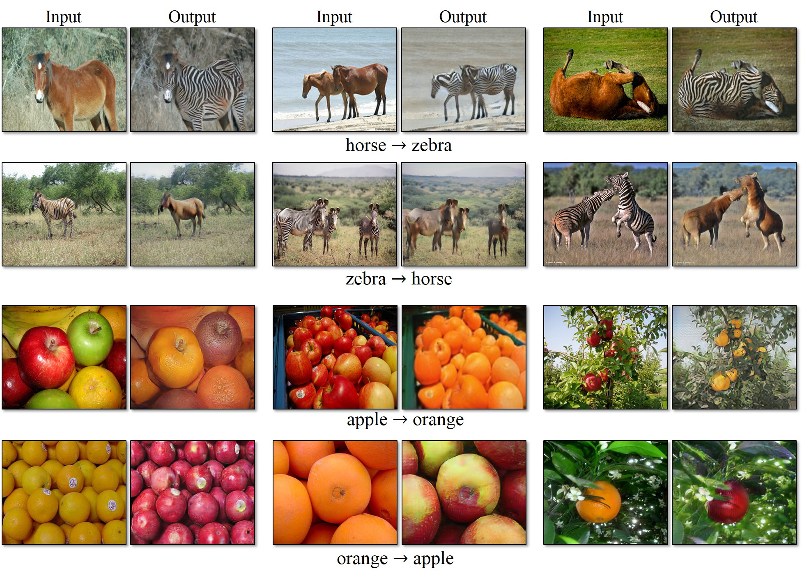

对于大部分年轻人来说，攀比心态和炫耀的心里我觉得会比较重。找到的应用也是属于gihub榜单排行上的应用
####项目####
- 在5秒钟内克隆语音以实时生成任意语音                                      ------>         https://github.com/CorentinJ/Real-Time-Voice-Cloning
- 适用于所有人的Deepfakes软件  换脸                                      ------>         https://github.com/deepfakes/faceswap

####理解####
- 以上两个应用我觉得可以归为一类，都是抓住了学生们贪玩以及可以炫耀的心理。首先上面两个项目就很有趣，对于可以模仿声音来说，我可以模仿任意一个人的声音讲话在朋友圈子里就可以做到很好的恶搞的效果，
- 对于视频换脸也是，联想到近期换脸应用一经推出就广受好评的现象，所以觉得换脸也是一个比较受年轻人喜欢的应用场景

####效果#####
  
换脸效果，左边为原始图像，右边是更换后的效果。[忽略图片中的水印]

--

####项目####
- 从图形用户界面截图生成代码 [前端实现]                                    ------>         https://github.com/tonybeltramelli/pix2code
- Keras模型可从手绘网站模型生成HTML代码。为绘制的源图像实现图像字幕体系结构。  ------>          https://github.com/ashnkumar/sketch-code

####理解####
- 以上两个可以归结为工具类，可以从手绘或者图片自动生成前端页面，可以节省一些学生提交作业的时间，有些作业可能会要求学生将一些报告或者成果以前端程序的方式来展现，这样的话使用上面的工具就会方便很多，
- 尤其是针对一些没有审美的理工男来说，这应该也会很受欢迎，我看到github上展示的效果很好看，但输入的手稿都很简陋

####效果#####

--

####项目####
- 从绘画中生成照片，将马匹变成斑马，执行样式转换等 [gan]                     ------>         https://github.com/junyanz/CycleGAN

####理解####
- 这类应用我觉得可以针对一些无聊的大学生使用，很多人可能只是有时间但不知道要做什么，那这时候就会想，我既然不知道要做什么，不如看看这个能给我的到一个什么样的结果也不错，说不定有些结果让我出乎意料又会觉得很有趣呢

####效果#####
 

####总结#####
这次看github榜单，发现上榜的程序并不是很多，分享的学习资料在榜单上的倒是比比皆是。不由想到，大家根据资料自己动手实现说不定会很有趣。而且对于大学生而言对学习有兴趣的也大有人在。
所以想到，应用可能只是锦上添花的一个点，对大家更实用的可能是给大家更便宜的gpu，并且证明这个gpu是可用的[推广可以用我用这个gpu完成了什么样的模型训练，证明这个gpu资源的可靠性]。应该就可以了，
毕竟对学生而言，经济实惠也是第一要义。
